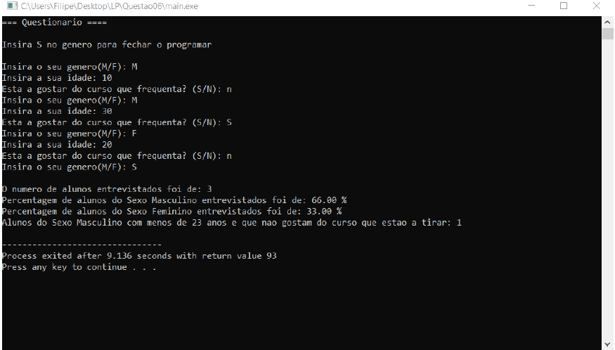

# Questionário
### Recolha de input do utilizador e apresentação dos dados que correspondem às variaveis estabelecidas
Trabalho desenvolvido para cimentar os conhecimentos adquiridos nas cadeiras de Linguagens de Programação e Algoritmos e Estruturas de Dados.

**O objetivo da aplicação é que esta seja capaz de calcular e informar:**

* O número de estudantesentrevistados 
* Percentagem deestudantes de género feminino e masculino 
* Quantidade de estudantes degénero masculinocom menos de 23 anos e nãogostam do curso que estão a tirar.

Se quiser utilizar o programa basta:
* Executar o ficheiro denominado "main.exe".

Aqui tem um exemplo do programa em execução:

